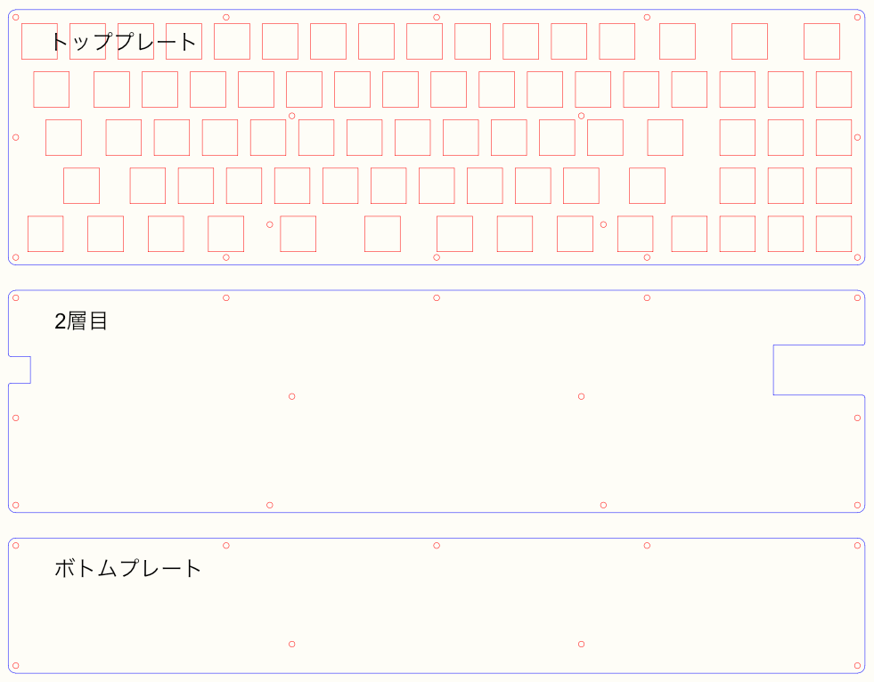

## テンキー付き一体型コンパクトキーボード「SNUC」

キーボードを自作した際の PCB ([kiCad](https://www.kicad.org)) データとプレートの SVG データです。  
諸事情により写真は横から撮ったもののみです。詳しい説明もありません。  

  
  
  

## 名称の由来

**S**: スペースキーが2つに別れており  
**N**: ニューメリックキー (テンキー) がある  
**U**: ユニボディ (スプリットでは無い) で  
**C**: コンパクトなキーボード  

## 特徴

- 使用するキーは1.75u 以下のみです (スタビライザーを使用しません)。
- テンキーはありますが縦3列しかありません。
- キートップの高さを抑えるため、手前の裏側は PCB がむき出しになります。

## 基板とプレート以外に作るために必要なもの

- キースイッチ (Cherry 互換) とダイオード 各78個
- キーキャップ (Cherry 互換) 1u 60個、1.25u 8個、1.5u 6個、1.75u 4個
- Pro Micro 等のコントロール基板1枚とコンスルー1セット
- 横から押すタイプのタクトスイッチ (THBP07ー043CW とか) 1個
- M2 のネジとスペーサ (PCB とプレートの厚みを考慮して長さは決定) 適量、 M2 のナット2個
- 脚に使う小さいクッションゴムとチルト用の脚 各2個
- ハンダごて、精密ドライバー等の工具
- ファームウェアとそれを書き込む環境

おおよそこの程度かと思います。  

## ライセンス

[MIT](./LICENSE.txt)ライセンスです。

CAD のパーツ類のデータはライセンスが異なる場合があります。  
